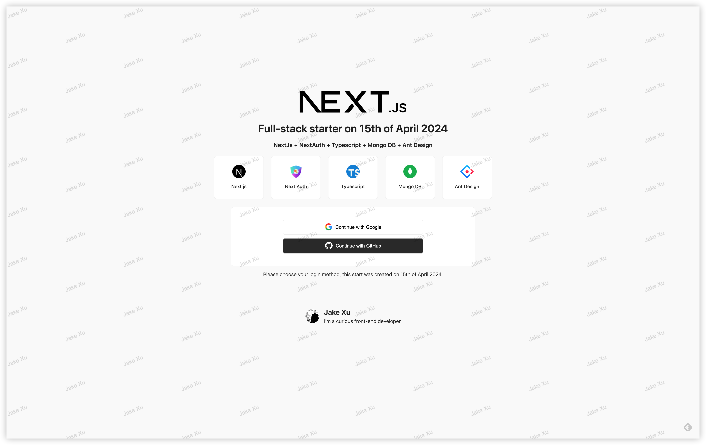

# Next.js Full-stack Starter

Welcome to use the **Next.js Full-stack Starter** template! It provides a starting point for creating full-stack applications with Next.js.


## Features ⚡

- **NextAuth:** Integration of NextAuth for authentication, providing support for various authentication providers.
- **TypeScript:** Developed with TypeScript for type safety and improved developer experience.
- **MongoDB:** Integration with MongoDB for database management and storage.
- **Ant Design:** Includes Ant Design for UI components, providing a sleek and modern design out of the box.
- **Styling:** Style using CSS, SASS, SCSS, or CSS-in-JS.



---

## How to use 🤔

To get started with this template, you just need to follow these simple steps:

1. Clone the repository:

   ```
   git clone git@github.com:JakeXu/nextjs-starter.git
   ```

2. Install dependencies:

   ```
   yarn install
   ```

3. Move `.env.example` file to `.env` and add the values for the following keys:

   ```
    NEXTAUTH_URL=
    NEXTAUTH_SECRET=

    GOOGLE_ID=
    GOOGLE_CLIENT_SECRET=

    GITHUB_ID=
    GITHUB_CLIENT_SECRET=

    MONGODB_URI=
   ```

4. Run locally

   ```
   yarn dev
   ```

5. [New OAuth App](https://github.com/settings/developers) if not exist, copy **Client ID** & **Client secrets** to `.env`

   
6. [New Database](https://cloud.mongodb.com/) for testing
   > **0.0.0.0/0** must be added to the whitelist

### License

Starter is [MIT licensed](./LICENSE).
